Online Auction System
====================================================================================

<u>**Team Leader:**</u>

Bokhodir Urinboev U1610249

<u>**Members:**</u>

Anvarjon Yusupov U1610026

Boburjon Iskandarov U1610054

Dostonjon Sukhrobov U1610064

Oybek Amonov U1610176

Rakhmatjon Khasanov U1610183

Outline 
=======

-   **Abstract **
-   **Introduction **
-   **Project Overview **
-   **Requirements definition **
-   **Project Design & Implementation **
-   **Results & Discussions **
-   **Conclusion **
-   **Future Work **
-   **References**

Abstract 
========

-   Automation and changing the process to the digital world makes
    everything easier to handle. So, now let’s see what happens beyond
    the cover of the system.
-   Our system mainly handles the process of auction, like the work of
    the organizers are handled by server-side and clients are supported
    in client-side of the software. Server-side mainly handles the
    database manipulation, connection with clients, process input from
    clients, send/receive responds, and of course money transaction and
    process it. Client-side is much plain to understand in our software,
    as it handles only connection, process responds from server,
    send/receive responds, money transaction.
-   In other words, the admin (in our case, there is only server who
    covers for an admin) get request for the auction to the specific
    good, he/she adds the good to the database and server sets up the
    date for the auction and notifies the client about this. So the
    auction begins then starting price is announced, then users raise
    the price and wait till the end of the process. And so it goes on.
-   We can claim that we can use our software in real world as nowadays
    even auctions and tenders are held on-line without going out the
    house. This is just demo version, further we can extend to the real
    alpha product adding additional features and improve the stability
    and performance.

Introduction 
============

-   From the period of 1995 to 2000 online auctions gone from nothing to
    the functional methods used by the millions of people from various
    industries. The factual example of the development of this system
    was introduced by the information list provided by Yahoo in 1998
    which explained that the number of the automatized auctions were
    about the 90 and in comparison to the number in current time the
    list is much bigger than existed ones.
-   Auctions made great success among the other forms of electronic
    commerce methods which is used in the industry. The functions that
    does exist in online auctions has obvious advantages over the local
    off-line ones as their functional process does not follow with
    automatized steps and highly vulnerable for the simple human factors
    and auction process physical destructions.
-   The online environment is conductive for the auctions in an online
    environment because of the following properties. The network
    supports dynamic communication which makes the management of the
    protocols involving unknown number of participants. Unlike physical
    concentration of misunderstandings and shout at the room made by the
    traders the network auction mediator can have direct access on the
    information of the participant and control with the process within
    the auction rules.

-   The case with online auctions make the process to be running in a
    real-time as in sense that off-line auctions tend to be which makes
    the identification of the participant easier and faster broadcast of
    the bids message (multicast communication protocols) Therefore, the
    widespread of the online auction protocols are not surprising in
    current moment.
-   All the functions including the participants’ identification in the
    beginning of the auction and the message notification while bid
    accepted or rejected by the participants and real – time monitoring
    control over the process of the auction procedures included in the
    system of the application that our team presenting in this report.

**Project Overview** 
====================

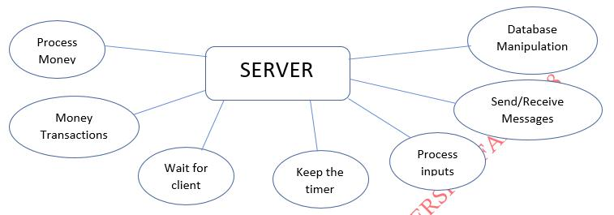

-   Database Manipulation - all the information on the goods are stored
    in server database. When the session starts all information is
    accessed and be ready to process. We used SQL server to hold the
    database. The database has the following tables: visa\_card(for
    money transactions operation journaling), bid(for recording
    information on successful biddings and the bidders), lot(information
    on lots are stored in this table), and client(information on clients
    are stored here).
    
-   Wait for client – as soon as server is in running state, it will
    wait for client connection. As in auction new client can come at any
    time, wait for client function will always wait for new clients.
    
-   Send/Receive Messages – our application will be working on messaging
    concept, all the time server will receive responds from users, and
    send new requests for users on new prize(bids), acknowledgement
    about auction process and goods.
    
-   Process inputs – as soon as server receives responds from user, it
    processes the input, validate it (if new prize is more than
    previous), if no new prize is not proposed this prize is accepted.
    
-   Keep the timer – when prize is proposed by client, time is now
    checked. If no increase in prize is received by server, the good
    will be sold.
    
-   Money transactions – as soon as the good is sold, money transaction
    process starts, server will wait for the right client to send money.
    
-   Process money - when received, the money will be processed in server
    side, taking some interest rate, and send to good owner.
    
    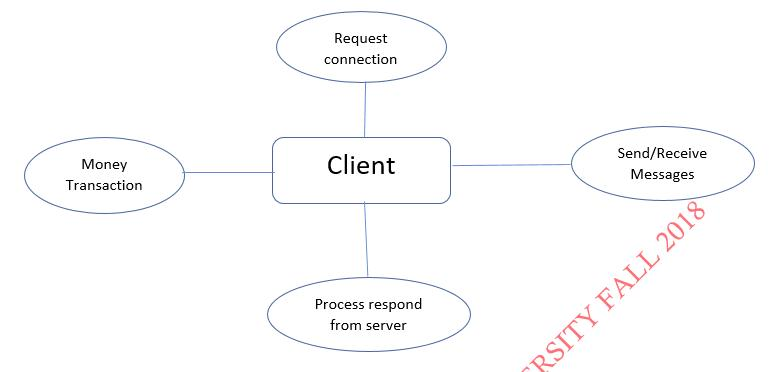

-   Request connection – to participate in auction user has to get
    connected to the server first, to do that request connection to
    server.
-   Send/Receive Messages – client listens to the server to receive
    about auction acknowledgement, prizes, goods information and etc.
-   Process responds from server – when information is received, it
    should be displayed to the user, and process the respond back to the
    server as soon as client decides to accept/refuse to buy the good
-   Money Transaction – if client buys the good, money should be sent to
    the server-side so the money is delivered to the good owner.

**Requirements definition**
===========================

-   The use-case diagram above describes main features and operations of
    our system called *AUCTION*. So, there are only 5 main
    functionalities that has to be carried out. They are *Authorisation
    (Registration* included and *Login*), *Money* *Transaction*, and
    *Auction*(*Adding new lots* and *Auction Bidding*) itself.
    Authorisation has two actors namely *CLIENT* and *SERVER.* The
    *Authorisation* use-case describes the process of the logging into
    the application. However, we all know that in all application one
    can register themselves as customer. Thus, we need a registration as
    well, so *Authorisation* includes into it the *Registration* too.
    The *Auction* use-case has the same, *CLIENT* and *SERVER,* actors.
    *Auction* use-case includes *ADDING NEW LOTS* and *AUCTION BIDDING*
    into it. The last use-case *MONEY TRANSACTION* has three actors, two
    clients *OWNER, AUCTION PARTICIPANT, and SERVER.
    
    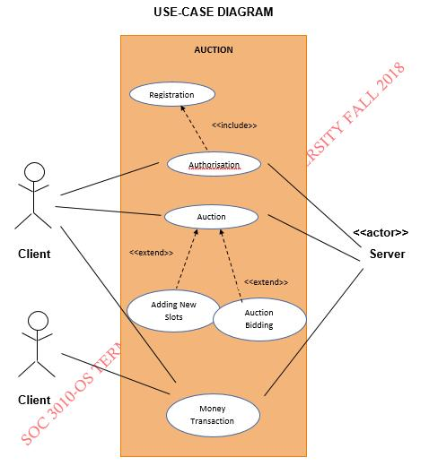The activity diagram describes the whole process where a client is
    offered the services we provided. Firstly, client has to pass the
    authorisation part. Assuming client has an account, he/she can
    successfully pass the authorisation part. A client can choose to
    register unless they do not have an account. A registration process
    will last until a client can register successfully. Registration may
    fail if the username of a new client is already existing in the
    database. After a successful authorisation, client is taken to the
    main menu, where user has 6 options. User can choose either to ask
    for available lots, adding a lot, see a profile, or a *ABOUT* part,
    and to *LOG OUT* or *EXIT*. Choosing first option user can see all
    lot for sale and can participate if wish. And, later come back to
    the main menu again. Option 2 offers the users to add their lots for
    sale, they are asked to provide some information on that and confirm
    the request. User is then taken to main menu again as in previous
    option. Option 3 enables the capability of showing the user their
    profile information which is requested from the server if chosen
    this option. User can either go back to main menu or choose to edit
    their profile information. Option 4 is given to see information on
    the organization and developer’s team. Last two options, namely 5
    and 6, are given to come out the application. Choosing *LOG OUT*,
    user is logged out and taken to *AUTHORISATION* window. When a user
    chooses the *EXIT* option, application is to be terminated.
    
    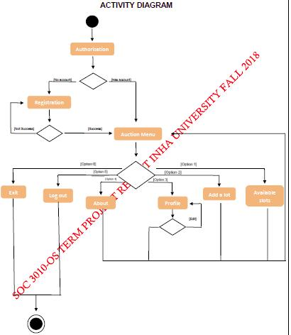The class diagrams show the structure we used to define our
    real-world entities. In our auction software, we work with clients,
    their lots, and the information on bids. So we have created above
    defined structures to store them. Client has own id, username,
    password, and visa card to pay for the lot they bought. When it
    comes to bidding, we need to know the which lot is being sold, its
    price, and who offers the price. The biggest entity in our diagram
    is lot itself, as you can see above. When a lot considered, it has
    its own id, minimum price, price of selling, who offered the price,
    information on lot (title, description, time for auction), and
    whether money transaction has been made after the auction.

-   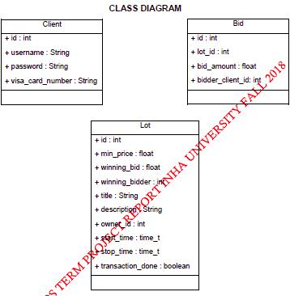

-   The diagram on the right depicts the behaviour of the client and
    server when a new user is to be created. Client requests the server
    to accept it as a new user. Server in turn checks the database for
    ambiguity between username, and whether the card of the user is
    valid. Then, Server responds to the client accordingly.
    
    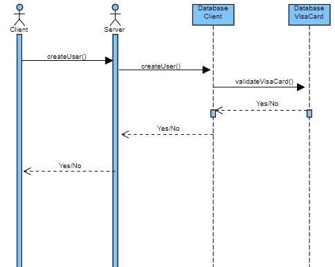

-   The diagram is for logging in process. User inserts the login
    information, and requests for the login. Server checks for the
    existence of the user, and responds to client accordingly.
    
    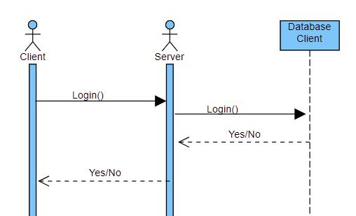

-   Sequential diagram below describes the behavior while creating a new
    lot. Client requests for accepting the lot, and server takes the lot
    information and assigns the lot time according to the earliest
    possible time after checking the last auction time.
    
    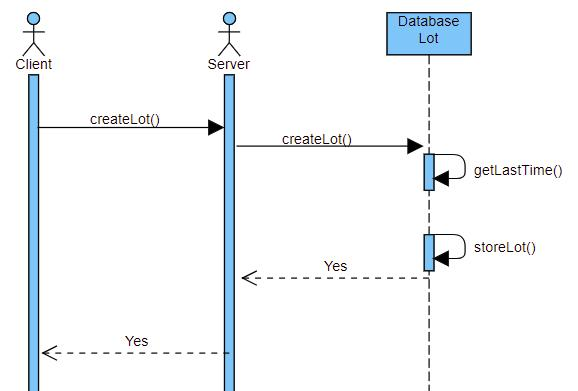

-   The behavioural diagram below shows the sequence of operations
    performed while actual auction happens. User asks for the available
    lots to choose. After choosing the lot, user takes part in an
    auction and possibly bids. Server handles the bidding after getting
    the request from the client
    
    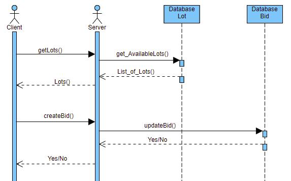

-   The diagrams describes the process of money transaction between a
    server and a client after an auction. User requests server for the
    transaction to occur. And, server does the job by accessing the
    database and calculating the money to be transferred to the lot
    owner and the amount to be charged
    
    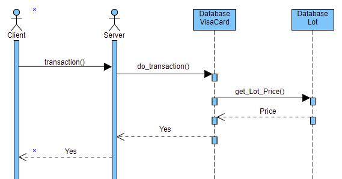

**Project Design & Implementation**
===================================

-   Design of the project was made with a help of GLADE and GTK
    (graphical toolkit). The graphical user interface of the application
    of the client side was fully written in C language and was linked
    with CSS (stylistic user interface scripting language) standard. The
    utilization of the GTK (graphical toolkit) was realized thanks to
    the libraries that does exist in documentation of the toolkit. The
    functionality of the client side gives an opportunity for the users
    to control over the processes of the lot availability and their
    personal information.
-   The first side that users face while using the application is the
    identification window. This step of identification is divided in two
    parts from which the first is “Login” part which is used for
    checking the registration of the existing user information.

-   The “Authorization” window gives two input boxes for the user one is
    “Name” and the second is “Password” where the user enters the
    information which is required for the authorization of the existing
    user (only in case of the user’s choice in “Login”).
    
    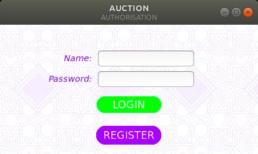
    
-   In case of the choice with “Register” button the user will be asked
    to enter the information for adding it to the database.
    
    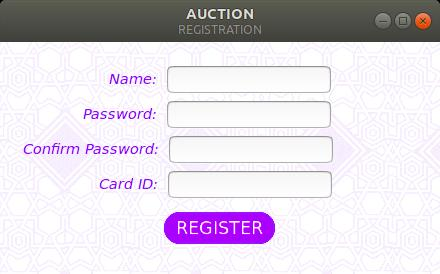

-   In case “Login” is successful by already registered user, the new
    window of the “Menu” window will be opened. The menu window consist
    of “Available lots” ,”Adding a lot”, “Profile”, ”About”, “Exit” and
    “Log out”.
    
    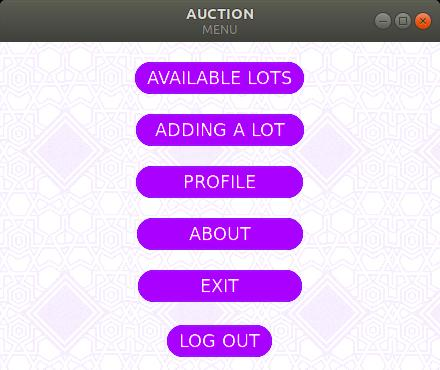

-   “Available lots” give the user an opportunity for controlling the
    process over the availability checking within the process of
    auction. And, assuming the client chooses this option, all lots for
    auction are received from the server and displayed on the screen as
    a list.
    
    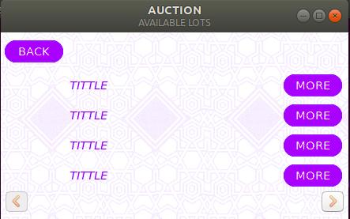
    
    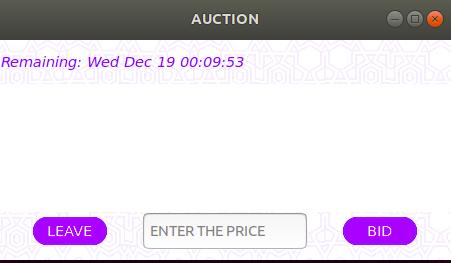

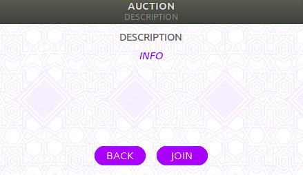

-   In the “Profile” section of the “Menu” user is able to check the
    information which was provided by the user himself/herself
    beforehand. In this window the user is able to modify, add or delete
    the information of the user.
    
    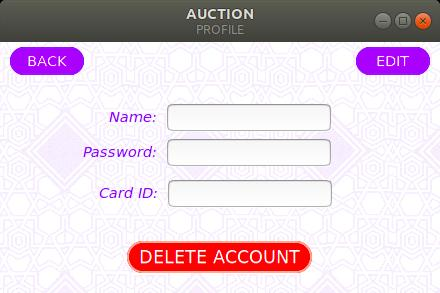

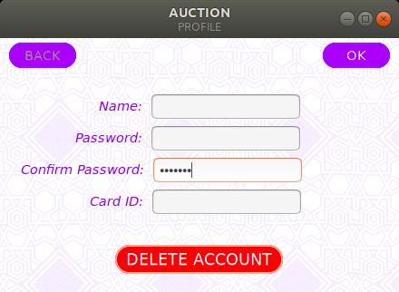

-   The window on the right is the GUI for an adding lot option of the
    main menu. User can input the required fields and press *ADD*
    button. And, user is taken to *CONFIRMATION* window, where a user is
    asked to confirm the operation after getting familiar with the
    *TERMS & CONDITIONS*.
    
    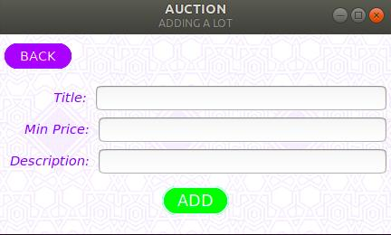
    
    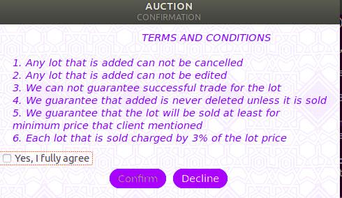

**Results & Discussions** 
=========================

-   From now on we will look at the what our team has achieved after
    weeks’ of implementing the system.
    
-   In the picture on the right , a user with name Dostonjon wants to
    register himself. He provided the required information, and presses
    the REGISTER button.
    
    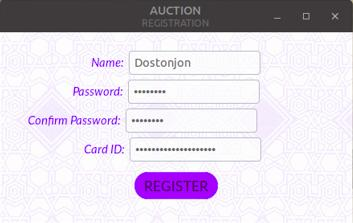
    
-   Afterwards, he is taken to the CONFIRMATION window, where
    TERMS&CONDITIONS is listed. User can either accept the terms or
    decline it. In case declining, user is not registered.
    
    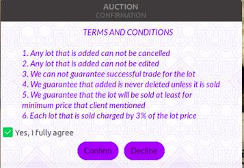
    
-   However, if user accepts, his information is first checked for
    ambiguity among users and visa card validity. Above information was
    not in the database, and client is new, also he has a valid visa
    card.
    
-   Thus, he is successfully registered and taken to the Main Menu.

**Results & Discussions** 
=========================

-   Assuming that user wants to participate in an auction, he can choose
    the *AVAILABLE SLOTS* and the above picture will appear with all
    available slots. User can choose to see more on the offered lot by
    clicking the *MORE* button and join the auction.
    
    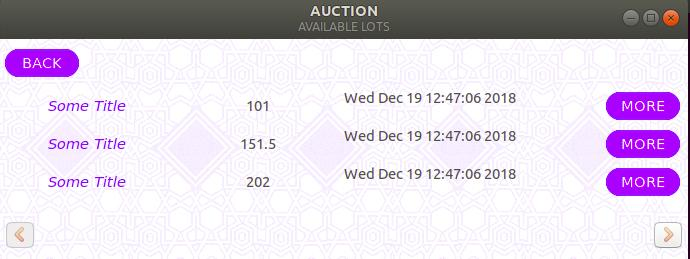

-   The below picture depicts the actual auction bidding process. Each
    client connected to server is given an ID, it is in column name in
    brackets. And, next to the name column there is a price column where
    each client gives a bid. The rule for bidding is that only when a
    client offers a price which is greater than previous bid, the
    current bid is accepted otherwise it is not accepted.
    
    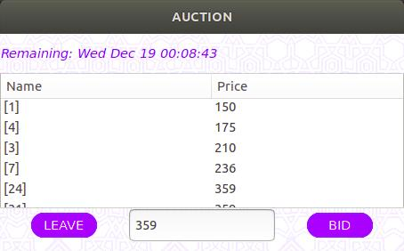

**Conclusion** 
==============

-   In our discussion part, we consider to be right only to discuss the
    main functionalities. Other parts, we are going to discuss in the
    Demo part of our presentation.
-   In the end of the project’s team work, we have made complete working
    auction which does have fully functional application based functions
    and features on the open source operating system Linux Ubuntu and
    all the tools related with it additionally a combination of C
    language, MYSQL and CSS
-   The GUI and the client side is also fully functional with presenting
    the user to monitor the availability of the lots and also giving the
    opportunity to add their own lot for the beginning of the new
    auction.
-   The overall result is good enough for even its release as we are
    quite confident for its functionality and overall operational work.

**Future Work** 
===============

-   For the upcoming years our team together is going to continue
    developing this technology toward the high industrial standard for
    making it to be ready for the utilization in the open market
-   The principal issue that we have currently is that the absence of
    the multi-thread synchronization system in work.
-   We planned to connect the application to the existing money
    transaction system while we could not manage time for the
    realization of this functionality and therefore decided to plan this
    part of the application for the future implementation.
-   Also, we planned to connect the application to the existing money
    transaction systems like PayPal, Payme or Click. Unfortunately, we
    could not manage time for the realization of this functionality and
    therefore decided to include this part of the application for the
    future implementation.

References: 
==========

[1\]. [http://dev.mysql.com](http://dev.mysql.com/)

[2\]. <https://www.w3schools.com/colors/colors_picker.asp>

[3\]. <https://stackoverflow.com/questions/5141960/get-the-current-time-in-c>

[4\]. <https://stackoverflow.com/questions/8352027/gtk-timer-how-to-make-a-timer-within-a-frame>

[5\]. <https://www.geeksforgeeks.org/socket-programming-in-cc-handling-multiple-clients-on-server-without-multi-threading/>

[6\]. <https://gist.github.com/oleksiiBobko/43d33b3c25c03bcc9b2b>

\[7\]. <https://www.relationaldbdesign.com/extended-database-features/module1/course-database-project.php>

[8\]. <https://developer.gnome.org/gtk3/stable/GtkListStore.html>

\[9\]. <https://habr.com/post/116268/>

[10\]. <https://prognotes.net/2015/07/gtk-3-glade-c-programming-template/>

[11\]. <https://prognotes.net/2016/03/gtk-3-c-code-hello-world-tutorial-using-glade-3/>

\[12\]. <https://ubuntuforums.org/archive/index.php/t-1176046.html>

[13\]. <https://developer.gnome.org/gtk3/stable/TreeWidget.html>